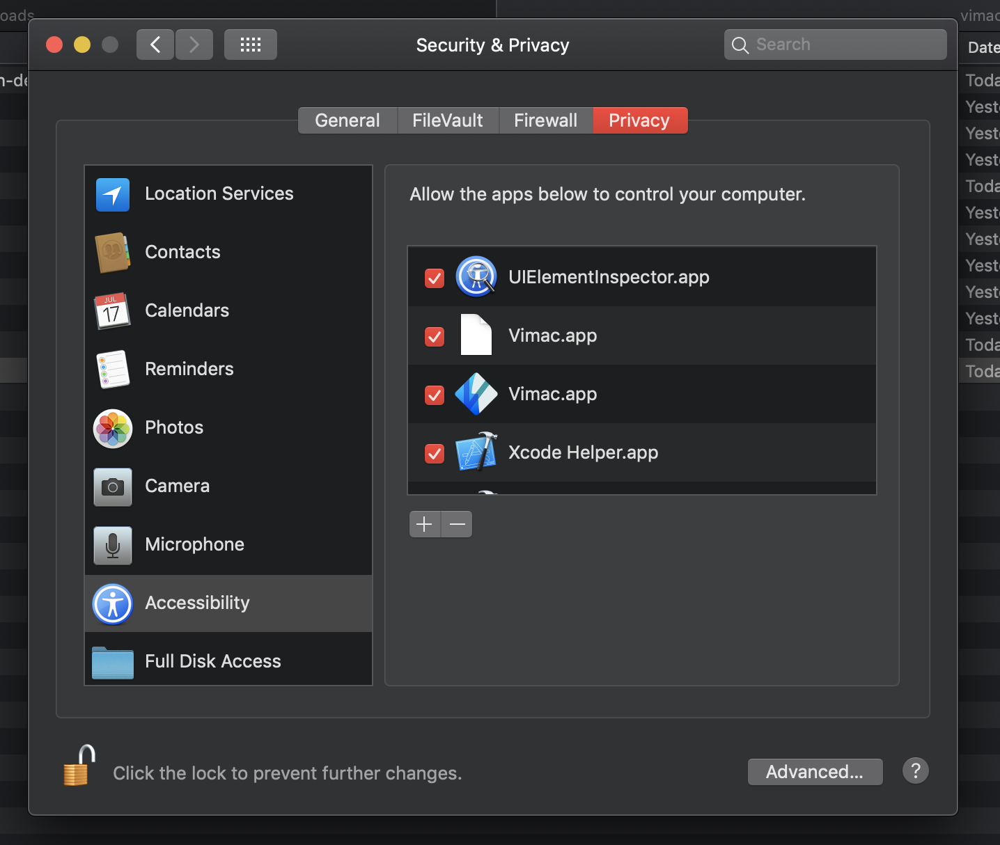

# Vimac - Vimium for macOS.

Vimac is a macOS app that supercharges your productivity with vim-like bindings.

# Installation

You can download Vimac [here](https://github.com/dexterleng/vimac-releases).

# Build instructions

1. Open the project with `Vimac.xcworkspace`, NOT `Vimac.xcodeproj`.
2. Execute `pod install` in the project directory to install dependencies.
3. Navigate to the Privacy tab in Security & Privacy in System Preferences:

Make sure to unlock the settings page by click on the lock and entering your credentials.

We need to perform step 3 because Vimac will lose Accessibility permission after a clean build. An AppleScript that grants the Accessibility permission is scheduled to run after a build. The script requires you to open the mentioned page in System Preferences.
