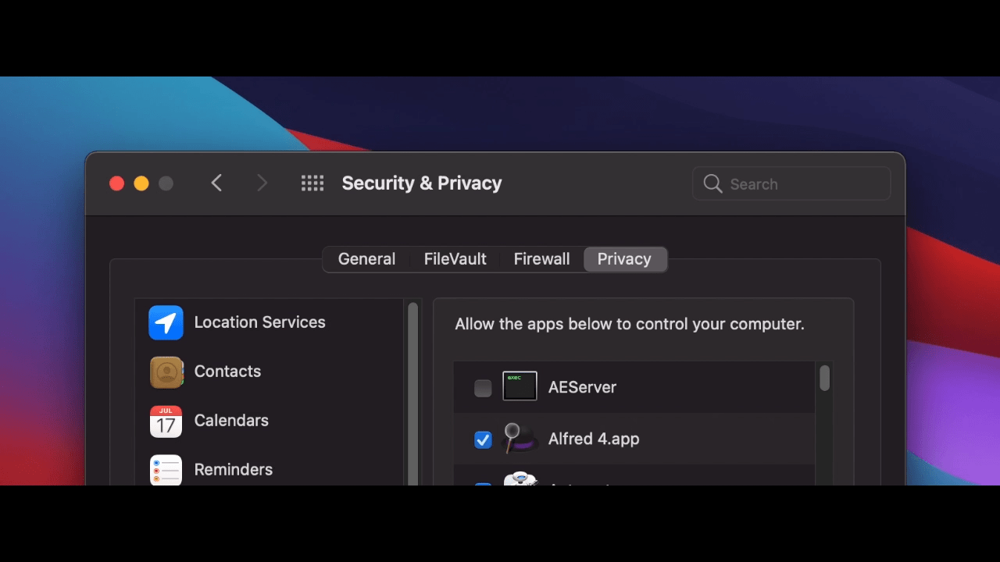
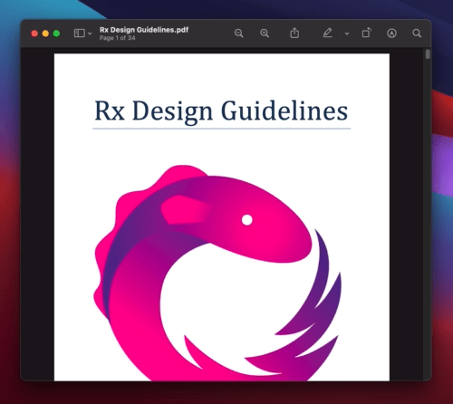
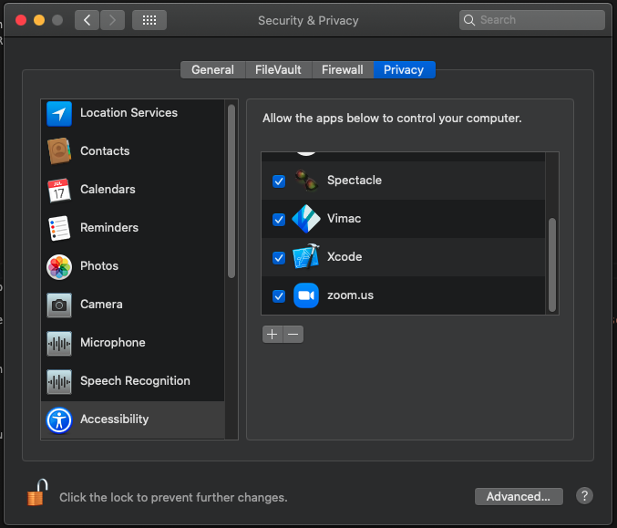

# Vimac - Productive macOS keyboard-driven navigation

Vimac is a macOS productivity application that provides keyboard-driven navigation and control of the macOS Graphical User Interface (GUI).

Vimac is heavily inspired by [Vimium](https://github.com/philc/vimium/).

## Getting Started

You can download Vimac [here](https://vimacapp.com). Unzip the file and move `Vimac.app` to `Applications/`.

You can refer to the manual [here](https://vimacapp.com/manual).

## How does Vimac work?

The current Vimac workflow works like this:

1. Activate a mode (`Hold Space to activate Hint-mode` is the default)
2. Perform actions within the activated mode
3. Exit the mode, either manually or automatically when the mode's task is complete

### Hint-mode

Activating Hint-mode allows one to perform a click, double-click, or right-click on an actionable UI element

Upon activation, "hints" will be generated for each actionable element on the frontmost window:



Simply type the assigned "hint-text" (eg. "ka") to perform a click at the location!

### Scroll-mode

Activating Scroll-mode allows one to scroll through the scrollable areas of the frontmost window.

Upon activation, a red border surrounds the active scroll area:



HJKL keys can be used to scroll within the scroll area.

## Building

```
pod install
carthage build
open Vimac.xcworkspace
```

Modify the Signing and Capabilities to the following (note the `Disable Library Validation` option):


Add Vimac and Xcode (for running AppleScript) to the list of Accessibility apps under **System Preferences > Security & Privacy > Accessibility**:



Keep System Preferences open under this section during development with the settings unlocked. This is because the `grant-accessibility-permission-dev.scpt` AppleScript is scheduled to run after each build to re-grant Accessibility permissions.

The AppleScript simply checks and unchecks Vimac to re-grant permissions which are lost after a cleanbuild.

Build Vimac now! You may have to build it several times as the AppleScript may not run well the first time.

At this point running `git status` would bring up:

```
modified:   ViMac-Swift/ViMac_Swift.entitlements
modified:   Vimac.xcodeproj/project.pbxproj
modified:   grant-accessibility-permission-dev.scpt
```

Avoid committing them.

## Contributing

Feel free to contribute to Vimac. Make sure to open an issue / ask to work on something first!
