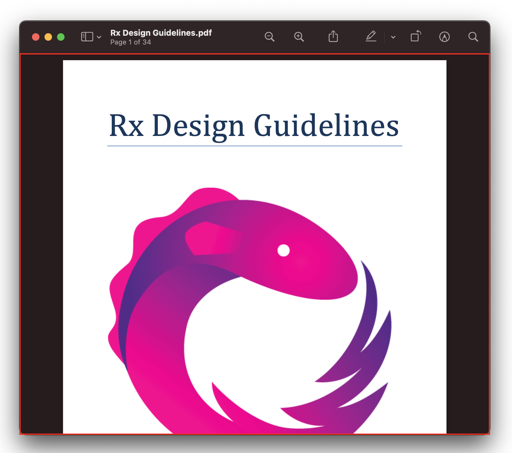
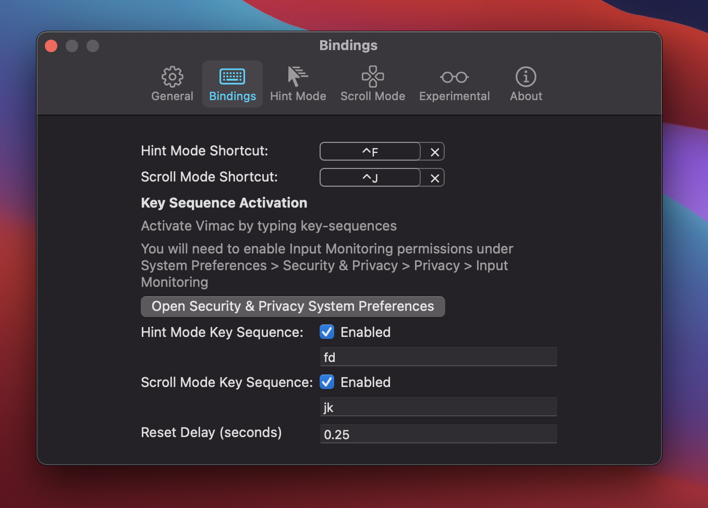

# Vimac - Productive macOS keyboard-driven navigation

Vimac is a macOS productivity application that provides keyboard-driven navigation and control of the macOS Graphical User Interface (GUI).

Vimac is heavily inspired by [Vimium](https://github.com/philc/vimium/).

## Getting Started

### Installing

You can download all versions of Vimac [here](https://install.appcenter.ms/users/dexterleng/apps/vimac/distribution_groups/sparkle). Unzip the file and move `Vimac.app` to `Applications/`.

### Workflow

The current Vimac workflow works like this:

1. Activate a mode
2. Perform actions within the activated mode
3. Exit the mode, either manually or automatically when the mode's task is complete

### Modes

There are two modes in Vimac.

#### Hint-mode

Activating Hint-mode allows one to perform a click, double-click, or right-click on an actionable UI element

Upon activation (default shortcut is `Control-F`), "hints" will be generated for each actionable element on the frontmost window:


Simply type the assigned "hint-text" (eg. "sa") to perform a click a the location!

| Action      | How to trigger |
|-----------|-------------
| Left click | Type the assigned hint-text |
| Right click | Type the assigned hint-text while holding `Shift` |
| Double left click | Type the assigned hint-text while holding `Command` |
| Rotate hints | `Space` |
| Exit | `Escape` |

Tip(s):
- After executing a right-click action, use `Control-N` and `Control-P` to select the next and previous context menu item respectively.

#### Scroll-mode

Activating Scroll-mode allows one to scroll through the scrollable areas of the frontmost window.

Upon activation (default shortcut is `Control-J`), a red border surrounds the active scroll area:



HJKL keys can be used to scroll within the scroll area.

| Action      | Default Key |
|-----------|-------------
| Scroll down | j |
| Scroll up | k |
| Scroll left | h |
| Scroll right | l |
| Scroll down by half the height of the scroll area | d |
| Scroll up by half the height of the scroll area | u |
| Activate another scroll area | `Tab` |
| Exit | `Escape` |

You can also scroll up/down/left/right by half a page by holding `Shift` when pressing the `hjkl` keys.

### Activation

There are two ways to activate modes:

- Keyboard Shortcut (e.g. `Control-F`)
- Key Sequence (e.g. `fd`)
  - Must be at least two characters long
  - Does not share a prefix with another registered key sequence

You may configure the bindings in the Bindings tab in Preferences:



## Building

```
pod install
carthage build
open Vimac.xcworkspace
```

Modify the Signing and Capabilities to the following (note the `Disable Library Validation` option):


Add Vimac and Xcode (for running AppleScript) to the list of Accessibility apps under **System Preferences > Security & Privacy > Accessibility**:


Keep System Preferences open under this section during development with the settings unlocked. This is because the `grant-accessibility-permission-dev.scpt` AppleScript is scheduled to run after each build to re-grant Accessibility permissions.

The AppleScript simply checks and unchecks Vimac to re-grant permissions which are lost after a cleanbuild.

Build Vimac now! You may have to build it several times as the AppleScript may not run well the first time.

At this point running `git status` would bring up:

```
modified:   ViMac-Swift/ViMac_Swift.entitlements
modified:   Vimac.xcodeproj/project.pbxproj
modified:   grant-accessibility-permission-dev.scpt
```

Avoid committing them.

## Contributing

Feel free to contribute to Vimac. Make sure to open an issue / ask to work on something first!
